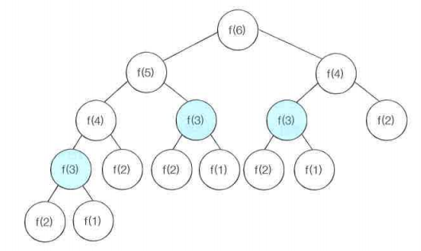

# 다이나믹 프로그래밍

## 중복되는 연산을 줄이자
- 최적의 해를 구하기에 시간이 매우 많이 필요하거나 메모리 공간이 매우 많이 필요한문제는 컴퓨터로도 해결하기 어렵다.
- 연산 속도와 메모리 공간을 최대한으로 활용할 수 있는 효율적인 알고리즘 작성 필요
- 메모리 공간을 약간 더 사용하면서 연산 속도를 비약적으로 증가시키는 대표적인 방법 Dynamic Programming
- 동적 계획법이라고 표현하기도 한다. 
- 다이나믹 프로그래밍으로 해결할 수 있는 대표적인 예시: 피보나치 수열

** 파이썬의 경우 기본 자료형인 리스트 자료형이 연결 리스트 기능을 포함하고 있음. 

### 심각한 시간 복잡도를 발생시키는 재귀함수

재귀함수로 구현한 피보나치 함수
```python
def fibo(x):
    if x==1 or x==2:
        return 1
    return fibo(x-1) + fibo(x-2)
```
- 위와 같이 피보나치 수열의 소스코드를 짜면 시간복잡도가 $O(2^N)$
- N=30 이면 약 10억 가량의 연산 수행 필요
- 동일한 함수가 반복적으로 호출되며 불필요한 연산 발생
- 이러한 문제를 다이나믹 프로그래밍으로 효율적으로 해결



### 다이나믹 프로그래밍을 사용할 수 있는 조건
1. 큰 문제를 작은 문제로 나눌 수 있다. 
2. 작은 문제에서 구한 정답은 그것을 포함하는 큰 문제에서도 동일하다. 

### 메모제이션(Memoization) 기법
- 다이나믹 프로그래밍 구현할 수 있는 기법 중 하나
- 한 번 구한 결과를 메모리 공간에 메모해 두고 다시 호출
- 메모한 결과를 그대로 가져오는 기법
- 값을 저장하는 방법이므로 캐싱(Caching)이라고도 함
  
메모제이션 기법을 사용한 피보나치 수열
```python
d = [0] * 100

def fibo(x):
    if x==1 or x==2:
        return 1
    if d[x]!=0:
        return d[x]
    d[x] = fibo(x-1) + fibo(x-2)
    return d[x]
```

### 반복문을 사용한 DP
- 재귀 함수를 사용하면 함수를 다시 호출했을 때, 메모리 상에 적재되는 일련의 과정을 따라야 하기 때문에 오버헤드가 발생할 수도 있다. 
- 일반적으로 반복문을 이용한 DP가 더 성능이 좋다. 
- DP를 적용했을 때 피보나치 수열 알고리즘의 시간복잡도? $O(N)$
- 재귀 함수를 이용한 DP는 **Top-Down 방식(하향식)**이며, 반복문을 이용한 DP는 **Bottom-Up 방식(상향식)**

### 결론
- 가능하다면 탑다운 보다는 보텀업 방식 권장
  - 재귀함수는 스택의 크기가 한정되어 있을 수도 있기 때문

## 문제
[1. 1로만들기](./%EB%AC%B8%EC%A0%9C_1%EB%A1%9C%EB%A7%8C%EB%93%A4%EA%B8%B0.md)\
[2. 개미전사](./%EB%AC%B8%EC%A0%9C_%EA%B0%9C%EB%AF%B8%EC%A0%84%EC%82%AC.md)\
[3. 바닥공사](./%EB%AC%B8%EC%A0%9C_%EB%B0%94%EB%8B%A5%EA%B3%B5%EC%82%AC.md)\
[4. 효율적인 화폐구성](./%EB%AC%B8%EC%A0%9C_%ED%9A%A8%EC%9C%A8%EC%A0%81%EC%9D%B8%ED%99%94%ED%8F%90%EA%B5%AC%EC%84%B1.md)